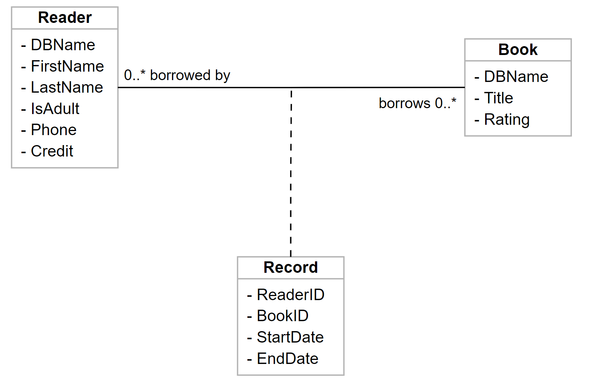

# Dapper Book Shop

Field test of Dapper along with a DB project.

The relationships of the models are defined as shown in the following class diagram.



(Note: Fields including `id`, `updateDate`, and `deleteDate` have been omitted.)

## Prerequisites

### Dependencies

``` xml
    <TargetFramework>net5.0</TargetFramework>
```

``` xml
    <PackageReference Include="Dapper" Version="2.0.90" />
    <PackageReference Include="Microsoft.Data.SqlClient" Version="3.0.0" />
    <PackageReference Include="Microsoft.Extensions.Configuration" Version="5.0.0" />
    <PackageReference Include="Microsoft.Extensions.DependencyInjection" Version="5.0.2" />
    <PackageReference Include="Microsoft.Extensions.Hosting" Version="5.0.0" />
```

### Configurations

Launch an MSSQL server (Locally, remote VM, or docker)

Build and publish `DapperORM.Database` project to your SQL server. If you are on Windows and have Visual Studio installed, you can right-click the project and select "Publish". However, if you are a Mac/Linux developer, you should install `SqlPackage` of your distribution, then build and publish `DapperORM.Database.Build` project instead.

Create `appsettings.Production.json` in the `DapperORM.App` project.

Specify the DB connection string. Example:

``` json
{
    "ConnectionStrings": {
        "DefaultConnection": "Server=[dbServerAddress],[Port];Database=[databaseName];User Id=[user];Password=[password];"
    }
}
```

Note: replace only the contents between square brackets. Do not touch the commas and the semi-colons. 
Check [sql-server connection Strings](https://www.connectionstrings.com/sql-server/) for details and other use cases.

## Test

Run the unit tests via `dotnet test [DapperORM.UnitTest]`

## Dev

If you have a new model, say `Pet`, you can follow these steps to create a new data access service.

Head to `DapperORM.Database`, go to `dbo`.

Create a new Table `Pets` and a new Type `InputPets`. Note that the names are in plural form.

Create a new Stored Procedure: `P_Mutation_SavePets`. Also, the model name is plural.

Build and publish the DB project (`DapperORM.Database` or `DapperORM.Database.Build`, based on your dev environment.) 

Head to `DapperORM.App`, go to `Models`.

Create 2 new records: `Pet` and `InputPet`, keep the fields accordingly to your DB Tables.

Create a new interface `IPetService`.

``` csharp
// IPetService.cs
namespace DapperORM.App.Services
{
    public interface IPetService : IDataAccessService<Pet, InputPet>{}
}

```

Create its implementation `PetService`. You can just provide the model singular name, and let the base data access service guess its table name.

``` csharp
// PetService.cs (Style 1)
namespace DapperORM.App.Services
{
    public class PetService: DataAccessService<Pet, InputPet>, IPetService
    {
        // Style 1
        public PetService(
            IDBContext dbContext
        ): base(
            dbContext,
            "pet" // <-- Note the entity name is singular
        )
        {}
    }
}
```

Or you can provide full control of names.

``` csharp
// PetService.cs (Style 2)
namespace DapperORM.App.Services
{
    public class PetService: DataAccessService<Pet, InputPet>, IPetService
    {
        // Style 1
        public PetService(
            IDBContext dbContext
        ): base(
            dbContext,
            "pet", // <-- Singular model name
            "pets", // <-- Plural model name
            "Pets" // <-- Table Name
        )
        {}
    }
}
```

At this point, provide your service in the DI system and use it. It should have basic CRUD access.

If the save stored procedure is special, you can also override the `Save()` method and provide your SP names.
